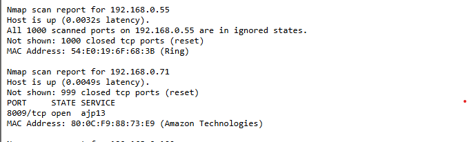

# Simple Network Scanner Web App

This project allows you to create a simple network scanner that is accessible from a web browser on your network. The project uses `nmap` to scan the network at regular intervals and presents the results via a web interface.

## Project Overview

Every 10 minutes, a **Cron Job** triggers the `nmap` command to scan the network and outputs the results into a text file. A **PHP** script is then used to format and present the contents of the text file in a web browser for easy viewing.

## Prerequisites

To get started, make sure you have the following tools installed:

- **Linux** (Ubuntu or similar)
- **Cron Jobs** for scheduled tasks (`crontab`)
- **Apache2** for the web server
- **PHP** for handling the web interface
- **nmap** for network scanning

### Install Dependencies

1. **Install Apache2, nmap, php**:
    ```bash
    sudo apt-get install apache2
    sudo apt-get install php
    sudo apt-get install nmap
    ```

2. **Ensure Apache2 is running**:
    After installing Apache, make sure it's running:
    ```bash
    sudo systemctl start apache2
    sudo systemctl enable apache2
    ```

### Create the Directory for Storing Network Scan Results

### Configure Ownership and Permissions 

sudo chown ubuntu /var/www/html/admin

sudo chmod 777 /var/www/html/admin

# Cron Job Configuration

sudo crontab -e

*/10 * * * * nmap 192.168.1.0/24 -oN /var/www/html/admin/nmap.html

# PHP Script: `network.php`

This PHP script displays the server's current timestamp and includes the content of the `nmap.html` file, preserving its formatting.

### PHP Code:

```php
<?php

echo "Server Timestamp: ";
echo date("h:i:sa");

echo "<pre>";
include("/var/www/html/admin/nmap.html");
echo "</pre>";

?>

```

Once the `nmap` scan is complete, you can check the `ipaddress/network.php`, and you will see the results of the scan.



# Security Hardening / Protect the Apache with Basic Authentication

This guide will help you secure your Apache web server using Basic Authentication.

## Step 1: Install `apache2-utils`

If `apache2-utils` is not already installed on your server, use the following command to install it. This package provides the utilities required for managing passwords.

```bash

sudo apt-get install apache2-utils

```
## Step 2: Create a `.htpasswd` File

Next, you need to create a `.htpasswd` file, which will store the usernames and passwords for Basic Authentication. Use the `htpasswd` command to generate the file and add a username.

```bash
sudo htpasswd -c /etc/apache2/.htpasswd username
```
Replace `username` with the desired username. The `-c` option creates the `.htpasswd` file. Be careful—if you add more users later, omit the `-c` flag to avoid overwriting the file.
```bash

sudo  /vim /etc/apache2/sites-available/000-default.conf

```
Make sure you select the proper directory and file based on your needs. 

Here, I am going to set `nmap.php` as my default file when the IP address is loaded via a web browser.


You will be prompted to enter and confirm a password for the new user.


Thank you 


